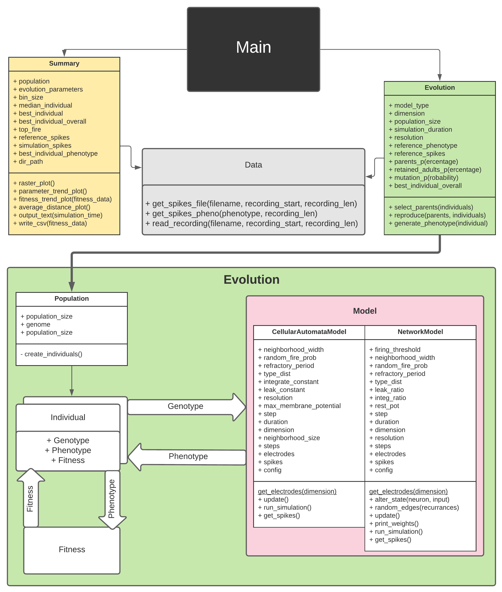

# ACIT4610 - Project 2
## Emulating features of in vitro cortical networks
This is the code repository for our submission of the final project assignment in ACIT4610 at OsloMet, 2020.
The group consists of Jørgen Farner, Christian Ruben Alexander Jahren & Håkon Weydahl.
##  Implementation
The application is implemented in Python 3.8.
We recommend using the Conda 3.8 distribution.
##  Contents
- **Archive:**
  > Scripts used to implement the models and test them visually using pycxsimulator.
- **Code:**
  > Our submitted solution. An evolutionary algorithm which evolves CA and Network models in order to emulate features of in vitro cortical networks.
- **Resources:**
  > The real data-sets that were provided for the project.
##  Running the code
You can run the program by editing the *evolution_parameters* in Main.py, and simply executing the script in your prefered environment.
##  Documentation
Please refer to our project report and the class diagram for an overview of the program and its applications.
Furthermore, you can view the output from our tests [here](https://hioa365-my.sharepoint.com/:f:/g/personal/s310455_oslomet_no/EgsOw3x0gA1AjXtwV9By04gBjytKTCE-wdlOOKYo6trmqQ).

